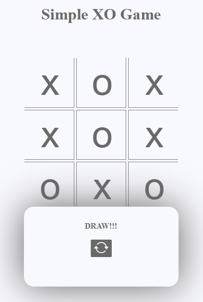

# NyG-simple-tic-tac-toe
A simple Javascript XO game!

🧮 NYG simple tic-tac-toe

a simple JavaScript XO game

📸 Preview

</img>

✨ Features

- ❌⭕ Tic Tac Toe gameplay — fully functional 2-player game
- 🎮 Turn-based system — alternates automatically between players
- 🧠 Win detection — checks all winning combinations
- 🤝 Draw detection — identifies tie situations correctly
- 🔄 Restart option — reset the game instantly
- ⚡ Real-time updates — immediate visual feedback on moves
- 🎨 Clean UI — simple and user-friendly interface
- 📱 Responsive design — works across different devices

🛠️ Built With

![HTML5]
![CSS3]
![JavaScript]

📁 Project Structure

NYG-Calculator/  
├── index.html     → Page structure  
├── style.css         → Visual styling  
├── script.js           → XO Logic  
└── [README.md](http://readme.md/)  → Project documentation

👤 Author

**Yuri** — [@NyG007](https://github.com/NyG007)